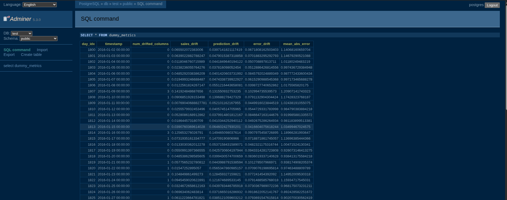
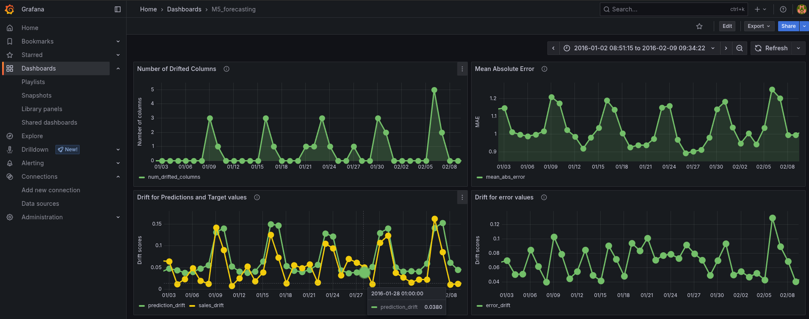
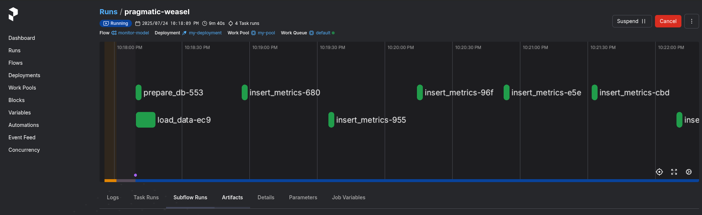

# 🚀 Deployment: Batch Inference & Monitoring

This folder simulates a **production pipeline** where daily data is ingested, predictions are made using the trained model, and the model is monitored for drift and performance degradation.


---


## 🔄 Workflow

1. Load a trained model from MLflow or local disk
2. Simulate daily input data
3. Predict using the model
4. Log predictions and metrics
5. Monitor drift and update the dashboard


---

## 🚀 Features

- 📉 **Drift detection** using Evidently (e.g., sMAPE, MASE, data stats)
- 🛢 **PostgreSQL** for storing monitoring metrics
- 🔍 **Adminer** for database browsing
- 📊 **Grafana** for model monitoring dashboards
- ⚙️ **Prefect** to orchestrate the entire pipeline


---
## 📂 Structure

```
Deployment/
├── codes/
│ ├── db.py
│ ├── model.py
│ ├── prediction.py
│ ├── config.py
│ └── reporting.py
├── config/
├── dashboards/
├── data/
├── tests/
├── monitoring_pipeline.py
├── start_prefect_deployment.sh
├── docker-compose.yaml
├── params.yaml             # Pipeline configuration
├── .env.example            # Environment variables template (for AWS S3)
├── requirements.txt
├── Makefile                # Workflow automation
├── .gitignore
└── README.md ← this file
```

---

## 🔧 Setup 

### 1. 📦 Install Python Dependencies

Create a virtual environment and install dependencies:


```bash
uv venv
uv pip install -r requirements.txt
```

Or manually:

```bash
pip install -r requirements.txt
```

### 2. 📁 Data

From training model (in `Development` folder), we have the processed features in `data/processed/`. This includes two files:
- `reference_data.csv`,
- `test_data`

Create the folder `data` and place these files there.

### 3, Configuring the model's location

In the `params.yaml`, you need to write the location of the model, such as

```bash
mlflow:
  experiment_id: '1'
  run_id: "m-3c280c4f771b4c3ca07d54a6d5089c40"
  model_dir: 'models'
```

---

## 🚀 Running the Pipeline 

Follow these steps to run the M5 forecasting pipel:

#### 1. Activate the virtual environment

```bash
source .venv/bin/activate
```


### 2. 🐳 Start Services via Docker

This brings up:

- PostgreSQL

- Adminer (http://localhost:8080)

- Grafana (http://localhost:3000)

```bash
docker-compose up --build -d
```

#### 3. 🚀 Run the pipeline

You can run the pipeline using `run_deployment.sh`. 

```bash
chmod +x run_deployment.sh
./run_deployment.sh
```
It opens a menu. You can select `Store code on a local filesystem`.


This script:

- Launches Prefect server

- Registers your pipeline as a Prefect deployment

- Starts a Prefect worker

- Run Inference + Monitoring

#### 4. Monitoring

In addition to forecasting for new days, it also computes some drift metrics (for monitoring). Its result can be seen in a dashboard, using Grafana (see below for more details).


## Workflow

After deployment, it follows the following workflow:

- Loads new data for a day (daily)

- Makes predictions (for the given day)

- Calculates metrics and drift (via Evidently)

- Saves evaluation reports (in PostgreSQL)

- Update the dashboard with the reports (in Grafana)


## 📊 Visualization & Monitoring

### 📉 Evidently

Drift metrics and distribution reports are automatically generated.

### 🗃 Adminer
To explore your PostgreSQL database (containing drift metrics):

```arduino
http://localhost:8080
```

Login :

- system: PostgreSQL

- Server: db

- Username: postgres

- Password: example

- Database: test



### 📈 Grafana

To view monitoring dashboards:

```arduino
http://localhost:3000
```

Login (default):

- Username: admin

- Password: admin



### Prefect

To observe the progress




### 📦 Makefile Commands

- `make install`  
  Installs all required Python dependencies listed in `requirements.txt`.

- `make test`  
  Runs all unit tests using `pytest` to verify code correctness.

- `make lint`  
  Checks code style and quality using `ruff`, `black`, and `isort`.  
  *Note:* This command **checks** formatting and reports issues but does **not** modify the code.

- `make lint-fix`  
  Automatically fixes linting and formatting issues with `ruff`.

- `make format`  
  Formats code using `ruff`.

- `make run`
  To run the pipeline.

- `make clean`  
  Removes Python bytecode files (`__pycache__`, `.pyc`, `.pyo`) to keep the repo clean.


## Clean up

After finishing the deployment, do not forget:

```bash
docker-compose down
```

