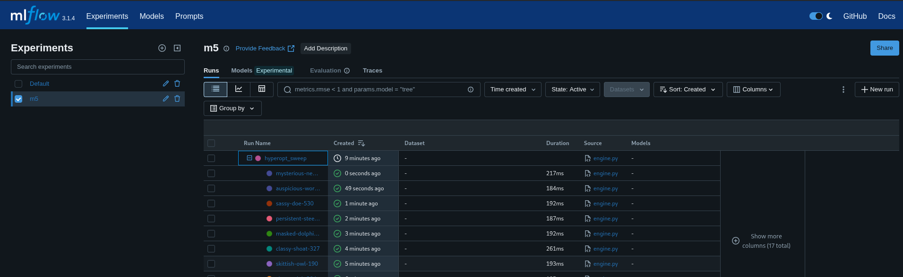

# 🛠 Development: Model Training Pipeline

An end-to-end machine learning pipeline for training a sales forecasting model using the M5 dataset. Built with modular components using **LightGBM**, **Hyperopt**, **Prefect**, and **MLflow**, the pipeline supports data ingestion, feature engineering, hyperparameter optimization, and model training with custom evaluation metrics.


---


## 🔄 Workflow

1. Load and preprocess data
2. Perform feature engineering
3. Run hyperparameter tuning with Hyperopt
4. Train a LightGBM model

---

## 🚀 Features

- ✅ Modular pipeline architecture using [Prefect](https://docs.prefect.io/)
- 🔁 Full feature engineering: lag features, rolling stats, calendar joins
- 🧪 Hyperparameter tuning via [Hyperopt](https://github.com/hyperopt/hyperopt)
- 📊 Custom metrics: sMAPE and MASE
- 📝 Experiment tracking with [MLflow](https://mlflow.org/)
- 🧼 Testable, maintainable, and MLOps-ready
- 📦 Lightweight with YAML-configured parameters

---

## 📂 Structure

```
development/
├── codes/
│ ├── data_loader.py
│ ├── feature_engineering.py
│ ├── best_model.py
│ ├── config.py
│ ├── tuning/
│ ├── metrics/
│ └── models/
├── tests/                  # Unit tests
├── data/
├── pipeline_training.py
├── params.yaml             # Pipeline configuration
├── .env.example # Environment variables template
├── requirements.txt
├── Makefile                # Workflow automation
├── start_prefect.sh
├── .gitignore
└── README.md ← this file
```

---

## ⚙️ Setup

### 1. Clone the repo

```bash
git clone https://github.com/mohammadimathstar/m5-forecasting.git
cd m5-forecasting/Development
```

### 2. Install dependencies

```bash
uv venv
uv pip install -r requirements.txt
```

### 3. Configure environment

```bash
cp .env.example .env
# Then edit `.env` with your credentials (for using S3)
```


### 📁 Data

- Place the original `sales_train_validation.csv`, `calendar.csv`, and `sell_prices.csv` inside: `data/raw/`

- Processed features and `test/reference` sets will be saved in: `data/processed/`


## 🚀 Running the Pipeline (with make)

Follow these steps to run the M5 forecasting pipeline locally:

#### 1. Activate the virtual environment

```bash
source .venv/bin/activate
```

#### 2. Run the pipeline

You can run the pipeline using `run_pipeline.sh` 

```bash
chmod +x run_pipeline.sh
./run_pipeline.sh
```
It opens a menu. You can select `Store code on a local filesystem`.

----

### MLflow

To track the experiment, we use Mlflow. You can modify its configuration in `run_pipeline.sh` script:

- backend-store-uri: the location for storing the meta-data, such as metrics, hyperparameters and etc. Here, we use sqlite.

- default-artifact-root: the location for storing the final model with its artifacts. Here, we use AWS S3.

- host and port: to see the experiment runs (default is `localhost:5000`)

Note. You must create the S3 bucket before running the script.



----

### Prefect

To see the progress of the workflow, you can open:
```bash
localhost:4200
```
and click on `Runs` tab.


### 📦 Makefile Commands

- `make install`  
  Installs all required Python dependencies listed in `requirements.txt`.

- `make test`  
  Runs all unit tests using `pytest` to verify code correctness.

- `make lint`  
  Checks code style and quality using `ruff`, `black`, and `isort`.  
  *Note:* This command **checks** formatting and reports issues but does **not** modify the code.

- `make lint-fix`  
  Automatically fixes linting and formatting issues with `ruff`.

- `make format`  
  Formats code using `ruff`.

- `make run`
  To run the pipeline.

- `make clean`  
  Removes Python bytecode files (`__pycache__`, `.pyc`, `.pyo`) to keep the repo clean.


